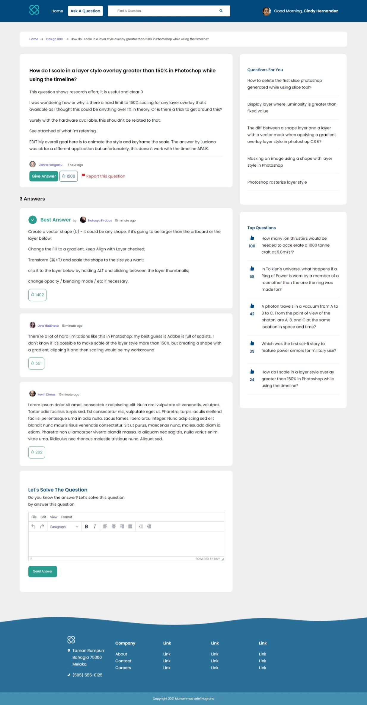

<h1>Q&A Student Community</h1>

    

 

Q&A Student Community is the place for students to ask and answer about their lesson.

This is my work from designing the interface using figma and then slicing it to become real website

This template is create using HTML, SASS, and Javascript

There are 3 pages:

<ol>
    <li>
        <a href="https://qastudentcommunity.vercel.app/login.html"><b>Login Page</b></a>
        
Students who want to ask or answer the question, must to login first. They can login using email and password or use their Google or Facebook account
    </li>
    <li>
        <a href="https://qastudentcommunity.vercel.app/searchresult.html"><b>Search Result Page</a></b>
        
When student type the keyword in search form and click the search icon, they will directed to this page. In this page, student can see all questions related to the keyword that they inserted. Students can also do sort and filter the question to get better results

    </li>
    <li>
    <a href="https://qastudentcommunity.vercel.app/question.html"><b>Question Page</b></a>
    
This page student can see more detail question, the answers, and also student can answer the question when visit this page

    </li>
</ol>

If you want to clone or download this repo, plis give the star to this repo to support my work

Open for work: <a href="mailto:muhammadariefnugraha77@gmail.com">muhammadariefnugraha77@gmail.com</a>

<a href="https://www.facebook.com/muhammad.ariefnugraha">Facebook</a> | 
<a href="https://www.linkedin.com/muhammad-arief-nugraha">Linkedin</a> | <a href="https://www.instagram.com/dvkentury">Instagram</a>